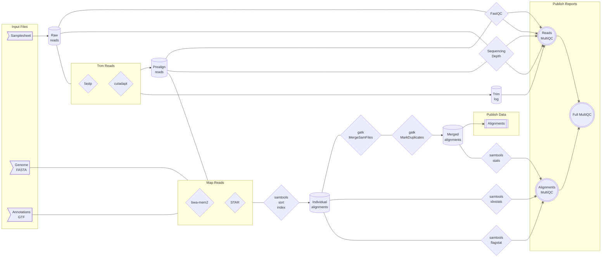

# `utia-gc/ngs`

[](https://code.askimed.com/nf-test)
[](https://lifecycle.r-lib.org/articles/stages.html#experimental)
[](https://sylabs.io/docs/)

:book:[Full documentation on GitHub Pages]:book:

## Introduction

`utia-gc/ngs` is a [Nextflow](https://www.nextflow.io/) pipeline for base NGS analysis.
While `utia-gc/ngs` can be run on any platform supported by Nextflow, it is developed for use in HPC environments and specifically [ISAAC Next Generation] at the University of Tennessee, Knoxville.

> [!WARNING]
> It is usually not a good idea to directly run `utia-gc/ngs`. This pipeline is designed to be a starting point for pipelines dedicated to specific analyses. It is generally not meant to be run itself. It will not often have scheduled or tagged releases, and as such it cannot reliably be used reproducibly. In nearly all cases, users should check the forked repos to find a pipeline built from `utia-gc/ngs` that is more suited to their needs or fork the repo to create their own versioned releases of a pipeline built on `utia-gc/ngs`.

### Pipeline overview



## Quick start

### Prerequisites

1. Any POSIX compatible system (e.g. Linux, OS X, etc) with internet access

   - Run on Windows with [Windows Subsystem for Linux (WSL)](https://docs.microsoft.com/en-us/windows/wsl/). WSL2 highly recommended.

2. [Nextflow](https://www.nextflow.io/) version >= 21.04

   - See [Nextflow Get started](https://www.nextflow.io/docs/latest/getstarted.html#) for prerequisites and instructions on installing and updating Nextflow.

3. [Singularity](https://sylabs.io)

### Get or update `utia-gc/ngs`

1. Download or update `utia-gc/ngs`:

    ```bash
    nextflow pull utia-gc/ngs
    ```

2. Show project info:

    ```bash
    nextflow info utia-gc/ngs
    ```

### Test `utia-gc/ngs`

1. Check that `utia-gc/ngs` works on your system:

   - `-profile nf_test` uses preconfigured test parameters to run `utia-gc/ngs` in full on a small test dataset stored in a remote GitHub repository.
   - Because these test files are stored in a remote repository, internet access is required to run the test.
   - For more information, see the `profiles` section of the [nextflow config file](nextflow.config).

   ```bash
   nextflow run utia-gc/ngs \
      -revision main \
      -profile nf_test
   ```

> [!IMPORTANT]
> In accordance with best practices for reproducible analysis, always use the `-revision` option in `nextflow run` to specify a tagged and/or released version of the pipeline.

### Run `utia-gc/ngs`

TODO

[Full documentation on GitHub Pages]: https://utia-gc.github.io/ngs/
